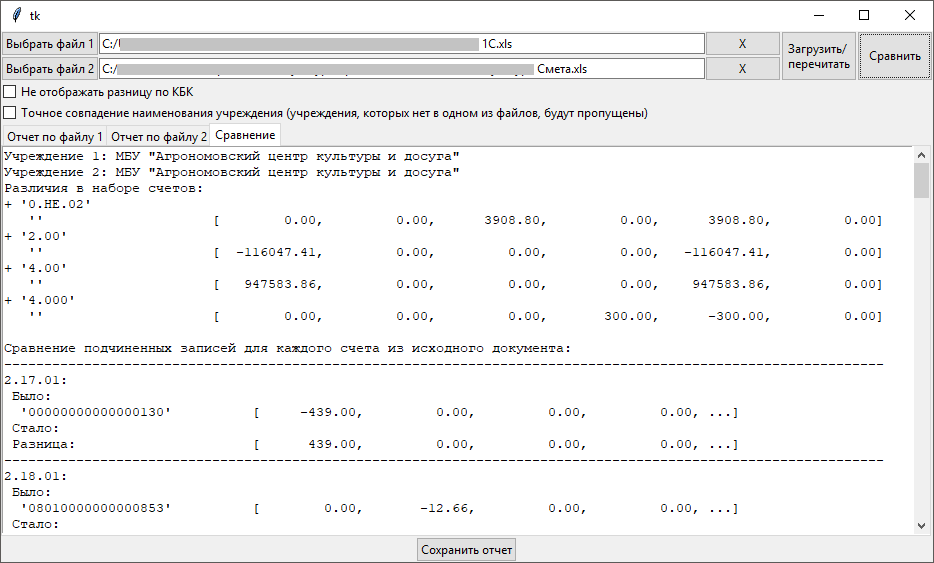

# Программа сравнения оборотно-сальдовых ведомостей

Основное назначение - сравнение оборотно-сальдовых ведомостей при подготовке баз 1С-БГУ к конвертации в Смету-СМАРТ (например, до и после свертки) и при проверке результата конвертации (сравнение оборотно-сальдовой ведомости из 1С и из Сметы-СМАРТ).

## [Скачать](https://bitbucket.org/insolor/osv_cmp/downloads/osv_cmp_gui.7z)

# Настройки формирования оборотно-сальдовых ведомостей

## Настройка в 1С:

* Период - текущий год
* Группировать по:
    * КФО
    * Счет
    * КПС
* По субсчетам - включено
* Выводить забалансовые счета - включено

## Настройка в Смете-СМАРТ

* Период - текущий год
* Группировка полей:
    * Виды финансового обеспечения
    * Код счета (6 знаков)
    * КБК
* Выводить забалансовые счета - включить

При других настройках группировки в 1С и Смете-СМАРТ правильная работа программы не гарантируется.

# Краткая инструкция

* Запустить программу
* Нажать кнопку `Выбрать файл 1`, выбрать файл (оборотно-сальдовая ведомость до операции - до свертки или до конвертации)
    * Отобразится отчет загрузки файла
* Нажать кнопку `Выбрать файл 2`, выбрать файл (после свертки или после конвертации)
    * Отобразится отчет загрузки файла
* Нажать кнопку `Сравнить`
    * Отобразится сравнительный отчет. Знак `-` обозначает, что что-то было в исходном файле, но отсутствует в ОСВ после изменений. Знак `+` имеет противоположный смысл - что-то добавилось.
    * Некоторые изменения допустимы, например в некоторых счетах в Смете-СМАРТ не будут отображаться остатки на начало года.
    * Сравнение сумм производится с учетом того, что некоторые суммы могут отображаться на "противоположной" колонке (в дебете вместо кредита или наоборот) с противоположным знаком.
    * Возможно отображение ложного различия между для счетов, оканчивающихся на 00 или 000. И в том и в другом случае в ячейке Excel стоит ноль, различие только в формате ячейки.
* Кнопка `Загрузить/перечитать` нужна на тот случай, если пути к сравниваемым файлам прописывались вручную, либо если файлы были изменены извне (например, заново выгружены из 1С или Сметы-СМАРТ). После ее нажатия содержимое файлов загружается в программу, заново формируются отчеты о загрузке, отчет о сравнении очищается.
* После сравнения можно сохранить полный отчет (отчеты загрузки файлов + отчет сравнения) в текстовый файл, например, для того чтобы его распечатать. Копирование текста из отчета с помощью `Ctrl-C` на данный момент возможно только в английской раскладке, возможно в будущем это будет доработано.

# Возможные доработки (TODO):

* Предупреждение, если 109.* счет не исправлен
* Предупреждение, если ОСВ из 1С выгружена без разделения по субсчетам
* Вывод разницы для различающихся сумм?
* Вывод КБК из Сметы в таком виде, как они записаны в ОСВ (с точками)

# Ссылки

* [О программном комплексе Смета-СМАРТ](http://www.keysystems.ru/products/salary-personnel/EstimateSmart/)
